# SBOMの非同期アップロード機能の全体像

- Status: Proposed
- Date: 2026-09-26

## 概要

SBOMの原本をObject Storageへ保存し、非同期ワーカーによってパース・正規化したデータをRDBへ保存する。

アップロード処理と解析・DB書き込みを分離し、Messaging Queueを介して処理することで、一時的に大量のSBOMがアップロードされた場合でも、ワーカーおよびRDBへの負荷を平滑化する。

また、Object Storage、RDB、Messaging Queueを跨ぐ処理で障害が発生した場合でも、SBOM原本やメタデータの不整合、処理要求の欠落が発生しにくい構成とする。

## 目的

- SBOM原本をObject Storageへ保存し、イミュータブルなArtifactとして管理する
- CycloneDXやSPDXなどの入力形式に依存せず、アプリケーションで必要な情報をRDBへ正規化して保存する
- 大容量のSBOMをApp Serverのメモリへすべて展開せずにアップロード可能にする
- Messaging Queueを利用して非同期処理を行い、ワーカーおよびRDBへの負荷を平滑化する
- Object Storage、RDB、Messaging Queueを跨ぐ処理で発生する障害に対応できるようにする
- アップロード済みSBOMを後から再パース可能にする
- アップロードされたSBOM原本の完全性を検証できるようにする

## 非目的

- SBOMに含まれるコンポーネントに対する脆弱性分析
- 脆弱性情報の取得・更新
- VEXによる脆弱性評価ロジック

## 詳細

### 構成

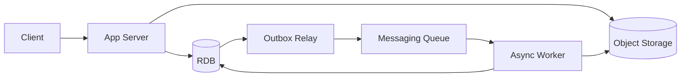

各コンポーネントの責務は以下とする。

- **Object Storage**
  - アップロードされたSBOM原本を保存する
  - SBOMをイミュータブルなArtifactとして管理する
  - RDBへ抽出していない情報も含め、入力されたSBOMをlosslessに保持する

- **RDB**
  - SBOMのメタデータを管理する
  - Project、SBOM Version、Artifactの関連を管理する
  - SBOMから抽出したコンポーネントや依存関係など、後続処理に必要な情報を管理する
  - Outbox Eventを管理する
  - 必要に応じて非同期処理の状態を管理する

- **Messaging Queue**
  - SBOM取り込み処理を非同期ワーカーへ配送する
  - 一時的なアップロード集中を吸収し、ワーカーおよびRDBへの負荷を平滑化する

- **非同期ワーカー**
  - Queueから処理対象のArtifactを受け取る
  - Object StorageからSBOM原本を取得する
  - SBOMの厳密なバリデーションを行う
  - SBOMをパース・正規化する
  - RDBへコンポーネントや依存関係などを保存する

### 処理フロー

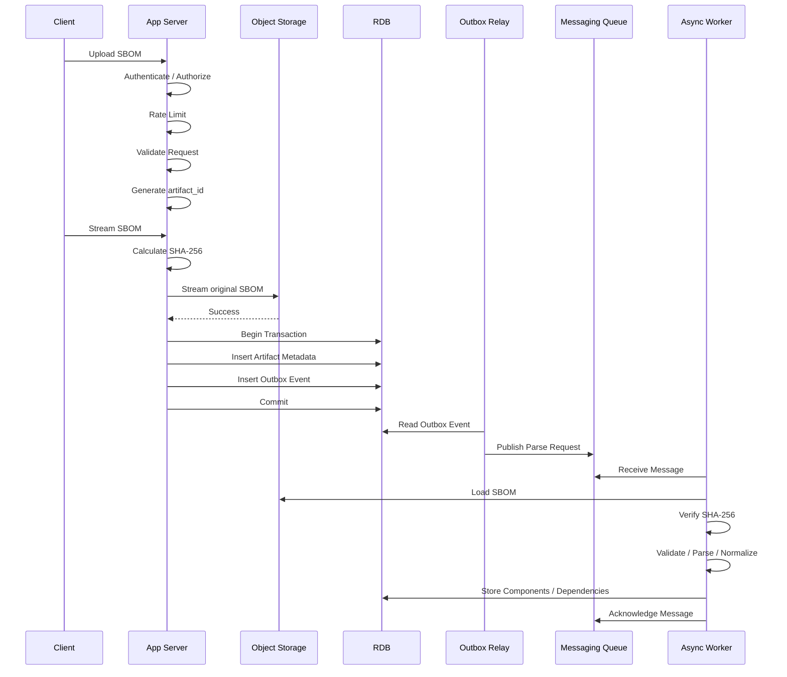

処理は以下の順序で行う。

1. クライアントからSBOMのアップロード要求を受け取る
2. App Serverで認証・認可を行う
3. アップロードAPIに対するレートリミットを確認する
4. リクエストサイズなど、アップロード前に確認可能な情報をバリデーションする
5. `artifact_id`を生成する
6. SBOMをストリーミングしながらObject Storageへ保存し、同時にSHA-256を計算する
7. RDBのトランザクション内でArtifact MetadataとOutbox Eventを保存する
8. Outbox RelayがOutbox EventをMessaging Queueへpublishする
9. 非同期ワーカーがQueueからメッセージを受け取る
10. `artifact_id`からObject Storage上のSBOM原本を取得する
11. SBOM原本のSHA-256を再計算し、RDBへ保存された値と一致することを確認する
12. SBOMの形式・スキーマをバリデーションする
13. SBOMをパース・正規化する
14. コンポーネントや依存関係などをRDBへ保存する
15. Queueのメッセージをacknowledgeする

### バリデーション

アップロード時には大容量のSBOMを受け取る可能性があるため、App Server上ですべての内容をメモリへ展開して厳密なSBOMバリデーションを行わない。

バリデーションは、アップロード処理と非同期処理で責務を分離する。

#### App Server

App Serverでは、Object Storageへ保存する前に確認可能な最低限のバリデーションを行う。

主に以下を対象とする。

- 認証・認可
- リクエストサイズ上限
- Content-Typeなどのリクエスト情報
- アップロードレート制限

SBOM本体はストリーミングしながらObject Storageへ転送する。

#### 非同期ワーカー

SBOM自体に対する厳密なバリデーションは、Object Storageへの保存完了後に非同期ワーカーで行う。

主に以下を対象とする。

- サポート対象のSBOM形式であること
- CycloneDX / SPDXのVersion
- JSON / XMLとして正常にパース可能であること
- Schema上必要な情報が存在すること
- パーサーが扱える範囲を超える異常な入力でないこと

これにより、App Serverで大容量のSBOM全体を保持する必要をなくし、アップロードAPIのメモリ使用量を抑える。

## SBOMデータの管理

### Object Storage

Object StorageにはアップロードされたSBOM原本を保存する。

SBOMはイミュータブルなArtifactとして扱い、既存Artifactを直接編集しない。

アプリケーション上でSBOMやVEXなどの内容が変更された場合は、既存Artifactを書き換えるのではなく、新しいArtifactまたはVersionとして管理する。

Object Storage上のSBOM原本は、RDBに保存していない情報も含めて完全な状態で保持する。

これにより、将来的にRDBへ保存する情報が追加された場合でも、既存のSBOM原本を再パースして再構築できる。

### RDB

RDBにはSBOM原本そのものではなく、BombSquadで利用するために必要な情報を正規化して保存する。

主に以下を管理する。

- Artifact Metadata
  - `artifact_id`
  - Project
  - SBOM Version
  - Format
  - Digest
  - Object Storage Key
  - Created At
- Components
- Component Versions
- Package Identifiers
- Dependency Relationships
- Licenses
- その他、脆弱性分析に必要な情報

CycloneDX、SPDXなど入力フォーマットごとの差異はParserで吸収し、RDBにはアプリケーション内部の共通モデルとして保存する。

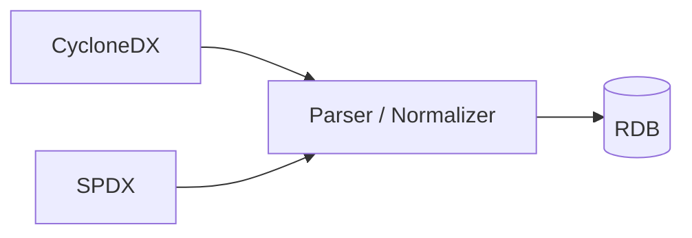

これにより、後続の脆弱性分析やVEX処理では入力フォーマットを意識する必要がなくなる。

Object StorageとRDBの責務は以下とする。

- Object StorageはSBOM原本の正本として扱う
- RDBはBombSquadが利用するDomain StateおよびQuery Modelとして扱う

## Object Storageライフサイクル

SBOMは古いVersionであっても、過去の構成確認や再解析などで参照する可能性があるため、原則として削除しない。

一方で、最新Version以外は頻繁にアクセスされる可能性が低い。

そのため、一定期間経過した古いVersionについては、より低コストなStorage Tierへ移行する。

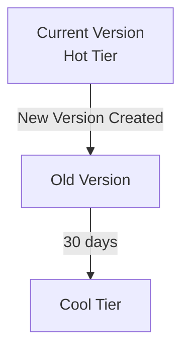

SBOM原本は通常のアプリケーション利用時には直接参照せず、基本的にはRDBへ正規化されたデータを使用する。

そのため、古いSBOMを低頻度アクセス向けTierへ移行してもアプリケーションへの影響は小さい。

## 障害時の対応

### Object Storageへの書き込み後、RDBへの保存に失敗した場合

Object Storageへの書き込みは成功したが、RDBへのArtifact MetadataおよびOutbox Eventの保存に失敗した場合、Object Storage上にRDBと紐付かない孤児Artifactが残る可能性がある。

主に以下のケースが想定される。

1. App Serverは稼働しているが、RDBへの書き込みに失敗した
2. Object Storageへの書き込み完了後、RDBへの書き込み前にApp Serverが停止した

#### App Serverがエラーを検知できる場合

RDBへの保存に失敗した場合、Object Storage上のArtifactをbest-effortで削除する。

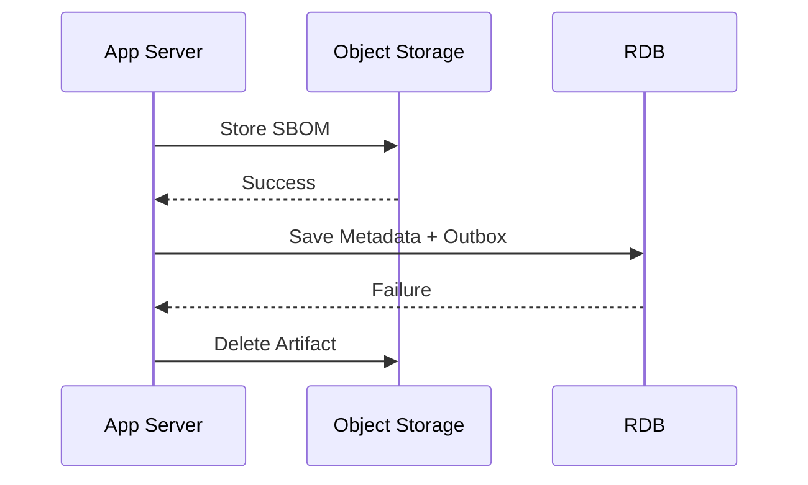

Object Storageからの削除にも失敗した場合は、後述するGC処理によって回収する。

#### App Serverが停止した場合

Object Storageへの書き込み後にApp Serverが停止した場合、削除処理そのものを実行できない。

そのため、アップロード開始時にアプリケーション側で一意な`artifact_id`を生成し、Object Storage上のKeyにも使用する。

`sboms/{artifact_id}/original`

定期的なGC処理では、以下の条件を満たすArtifactを孤児データとして削除する。

- Object Storageには存在する
- 一定時間以上経過している
- RDBに対応する`artifact_id`が存在しない

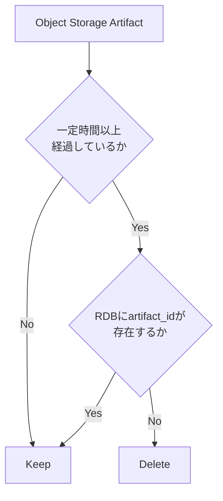

一度生成された`artifact_id`は、アップロード処理が失敗した場合でも再利用しない。

`artifact_id`にはUUIDv7を使用する。

### Outbox EventのPublishに失敗した場合

Artifact MetadataとOutbox Eventは同一のRDBトランザクションで保存する。

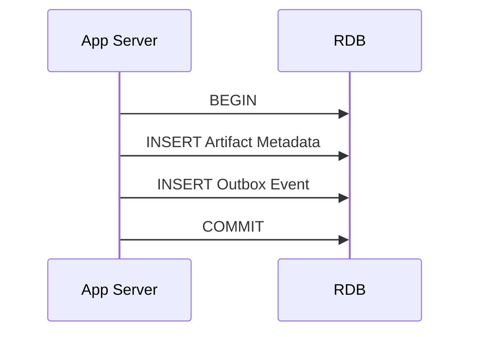

これにより、Artifact Metadataは存在するが、対応する処理要求が存在しない状態を防ぐ。

Outbox RelayがMessaging Queueへのpublishに失敗した場合は、Outbox Eventを保持したまま再試行する。

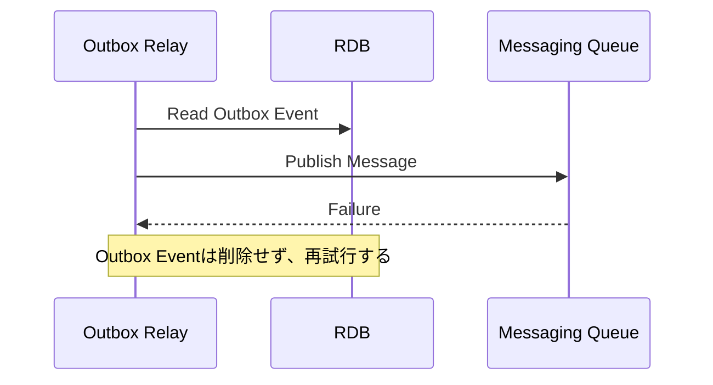

### 非同期ワーカーの処理が完了しなかった場合

主に以下のケースが想定される。

1. WorkerがSBOMを処理中に失敗した
2. DBへの保存には成功したが、Messaging Queueへのacknowledge前にWorkerが停止した

#### Worker処理中に失敗した場合

Workerが処理中に失敗した場合は、Messaging Queueからメッセージを再配送し、処理を再実行する。

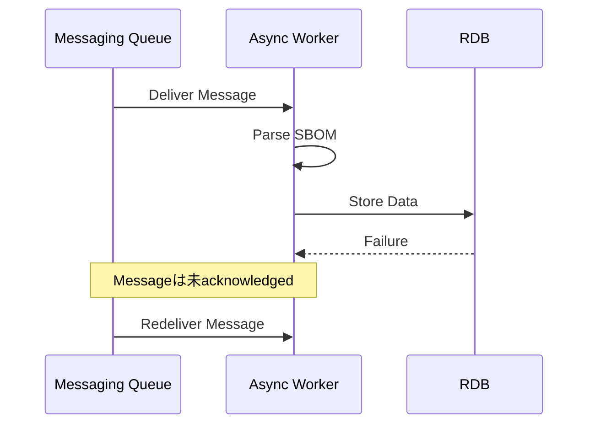

#### DB保存後、acknowledge前に停止した場合

DBへの保存に成功した後、Queueのメッセージをacknowledgeする前にWorkerが停止すると、同一メッセージが再配送される可能性がある。

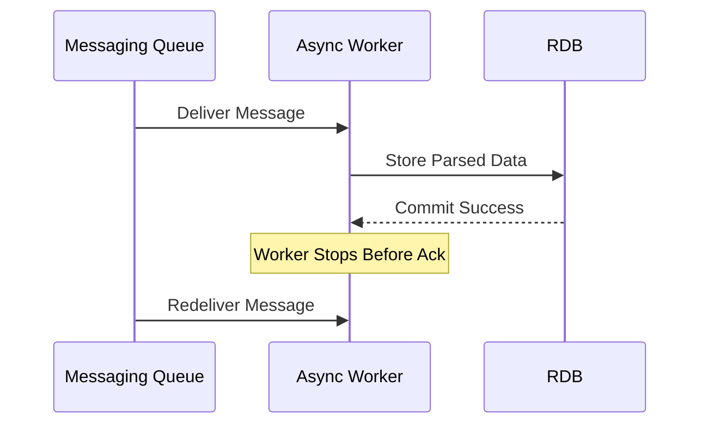

このため、WorkerによるDB書き込みは冪等にする。

`artifact_id`などを一意キーとして使用し、既に取り込み済みのArtifactに対して同じメッセージが再配送された場合でも、同じデータが重複して作成されないようにする。

## セキュリティ

### SBOM原本の完全性

アップロードされたSBOM原本が保存後に意図せず変更されていないことを確認できるようにする。

App ServerはSBOMをObject Storageへストリーミングする際にSHA-256を計算し、Artifact MetadataとしてRDBへ保存する。

WorkerがSBOMを処理する際はObject Storageから取得したデータについてSHA-256を再計算し、RDBに保存されたDigestと一致することを確認する。

一致しない場合は処理を中断する。

### Object Storageのアクセス制御

Object Storageはpublic accessを許可しない。

Object Storageへアクセスできる主体は、SBOMの保存・取得に必要なApp ServerおよびWorkerに限定する。

Azure上ではManaged Identityなどを利用し、それぞれのコンポーネントへ必要最小限の権限のみ付与する。

ClientからObject Storageへ直接アクセスさせず、SBOMへのアクセスはアプリケーションの認可処理を経由させる。

### テナント境界

`artifact_id`のみを利用したアクセスを許可しない。

Artifactへのアクセス時には、必ずTenantおよびProjectとの関連をRDB上で確認し、認可されたユーザーのみアクセスできるようにする。

WorkerもObject Storage上のパス情報を信頼せず、RDBに保存されたArtifact Metadataをもとに処理対象を特定する。

### アップロード制限

SBOMアップロードAPIは通常のAPIと比較して、ネットワーク帯域、Object Storage、非同期処理への負荷が大きい。

そのため、アップロードAPIにはレートリミットを設ける。

特にTenant単位で以下を制御する。

- 一定時間内のアップロード回数
- 同時アップロード数

また、1つのSBOMについてアップロード可能な最大サイズを設定する。

### Parser

Object Storageへ保存されたSBOMは未信頼入力として扱う。

Worker上でSBOMをパースする際には、異常な入力によってCPUやメモリを過剰に消費しないよう、処理可能なサイズやリソース使用量に上限を設ける。

XML形式をサポートする場合は、外部エンティティを解決しないParser設定を使用する。

## 他に検討した案

### Object Storageのイベントを直接処理開始トリガーにする

Object Storageへの保存完了をイベントとして検知し、そのままMessaging Queueを経由してWorkerを起動する構成も検討した。

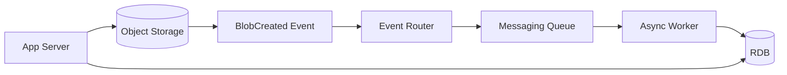

この方式では、Object Storageへの保存完了を起点として非同期処理を開始できる。

一方で、Object Storageへの保存とRDBへのArtifact Metadata保存は独立した処理となるため、両者の完了順序を保証できない。

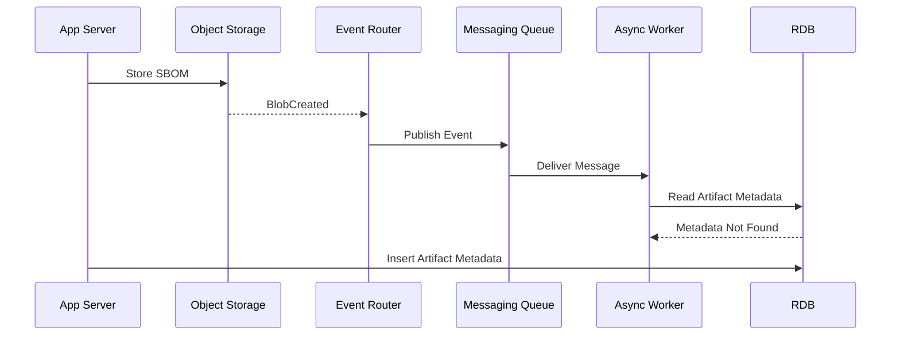

また、Object Storageへの保存には成功したものの、その後のRDBへのArtifact Metadata保存に失敗する可能性もある。

この場合でもBlobCreated Event自体は発生するため、WorkerがRDB上に存在しないArtifactを処理しようとする状態が発生する。

Object Storage側へProject IDなどのDomain情報を持たせ、Worker単独で処理可能にする方法も考えられるが、Object StorageとRDBの責務が混在するため採用しない。